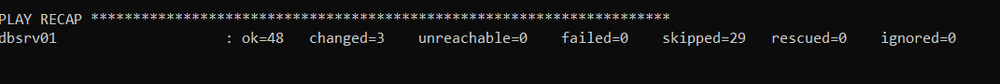

# Database Setup Manual

## Prerequisites

- Windows Systeem met minimum 8GB RAM
- Virtualisatie moet enabled zijn. Dit kan je controleren door naar de Taskmanager(Taakbeheer) te gaan. CTRL+ALT+DEL of via de Windows zoekfunctie. Ga nu naar Performance(Prestaties) en daar zal je Virtualisation op ingeschakeld of uitgeschakeld zien staan. Als je virtualisatie niet ziet staan dan wil dit zeggen dat jouw PC dit niet ondersteund en kan je deze manual ook niet voltooien. Als virtualisatie uitgeschakeld staat, dan zal je dit moeten aanzetten in de BIOS. Om naar de BIOS te gaan zal dit afhangen van de desktop/laptop van de gebruiker. 


- indien Hyper-V aanstaat, schakel deze dan uit. Dit kan je doen in de Windows onder Programs and features. Schakel Windows Hypervisor Platform of Hyper-V uit.


- Installaties:
  - git: <https://git-scm.com/>
  - VirtualBox + guest additions: <https://www.virtualbox.org/>
  - Vagrant: <https://www.vagrantup.com/>
    
- Installatie kan ook aan de hand van 'Chocolatey': <https://chocolatey.org/> <br>
Open CMD of Powershell als **administrator**
```
choco install git -y
choco install virtualbox --version 6.1.40 -y
choco install vagrant --version 2.2.16 -y
```
***Na installatie zal er gevraagd worden om een reboot te doen***

- Keuze om een management tool te installeren voor de SQL server:

**Mysql Workbench**

```
choco install mysql.workbench -y
```
Indien Chocolaty een error geeft bij de installatie, gebruik dan de volgende link: 
<https://www.mysql.com/products/workbench/>

Here's how to set up MySQL Workbench for your scenario:

Custom Setup Type:
During the installation process, when you reach the "Setup Type" screen, select "Custom."

Components Selection:
After choosing "Custom," you'll be presented with a list of components to install. Ensure that "MySQL Workbench" is selected (it's typically selected by default). This is the main component you need to interact with your MariaDB server.

Na installatie zal MySQL Workbench automatisch openen. Verbinding maken met de SQL server zal op het einde van dit document besproken worden. Eerst moet men de SQL server nog activeren zoals hieronder beschreven.

## Github Repo
Clone deze repository naar een lokale map op jouw computer: 

```
clone git@github.com:HOGENTDevOpsPrj/devops-23-24-operations-t01.git
```
De folder zal er op de volgende manier uitzien.  


## Database VM + container opstarten

Open **CMD** of **Powershell** door op de Windows toets te duwen en CMD of Powershell in te geven.  
Navigeer naar de volgende folder \devops-23-24-operations-t01\src\1.TestOmgeving\Code aan de hand van het "cd" commando. 

Het enige wat je nu hoeft te doen is "Vagrant up dbsrv01" in te geven. Alles zal nu automatisch geconfigureerd worden. Dit neemt ongeveer 3-4 minuten in beslag. 

```
vagrant up dbsrv01
```
Op het einde zou je dan ook het volgende bericht moeten krijgen waar FAILED=0 moet staan. Als dat niet het geval is, neem dan zeker contact op met de OPS. 


De VM is nu actief en dit kan je ook controleren in Virtualbox waar er een VM met de naam dbsrv01 op running staat. 

## Docker Container (Optioneel)

Om te controleren of de container dan ook effectief draait kan je een SSH sessie opzetten naar de server. Vanuit de directory waar je nog steeds aan het werken bent(devops-23-24-operations-t01\src\1.TestOmgeving\Code) voer je volgende commando in:
```
vagrant ssh dbsrv01
```
Eens ingelogd moet je gaan controleren of de service actief is. 
```
systemctl status docker
```
Gebruik nadien de shortcut CTRL+C om terug op de prompt commandline terecht te komen. 
je kan ook meteen kijken of er containers actief staan met volgende commando: 
```
sudo docker ps -a
```
Als er geen containers actief staan, vraag dan de logs op om te kijken wat er fout gelopen is en communiceer dit naar de OPS. 
Hiervoor heb je de Docker Container ID nodig. Dit staat in de eerste kolom.
```
docker logs "Container-ID"
```

## Verbinding maken met de SQL-server via MySQL Workbench

| Description | Details |
| --- | --- |
| Connection name | "Geef hier een naam in" |
| Hostname| 192.168.10.2 |
| Ports | 3306 |
| username | root |
| Password | Letmein!258 |

---
author: Mick Van Brantegem
---
