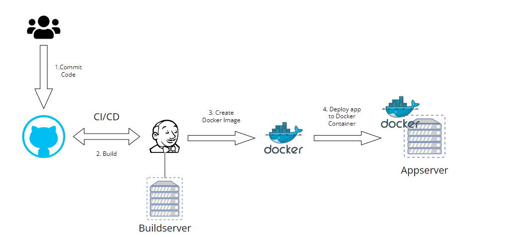

# Architectuurplan

1. Developer commit zijn/haar code naar de Github Repo.
2. Jenkins zal een trigger ontvangen en een pull doen van de laatste gepushte code.
3. In de Github Repo zit ook een dockerfile die beschrijft hoe de app moet worden opgebouwd. Aan de hand van deze dockerfile en code maakt Jenkins een Docker image aan. 
4. Docker image wordt gepusht naar een docker registery zoals Docker Hub of naar een lokale registery zoals hier het geval zal zijn. De appserver doet een pull van deze image en bouwt deze image aan de hand van een Docker Container.

## 1. Testomgeving

### Buildserver

| Description | Details |
| --- | --- |
| Name | Buildsrv01 |
| Operating System| Redhat Linux |
| RAM | 4GB |
| CPU | 1 |
| Disk Space | 20GB |
| IP-address | 192.168.10.1 |
| Ports | 80, 8080, 22, 8443|
| Services | Jenkins, Docker |

### Databaseserver

| Description | Details |
| --- | --- |
| Name | DBsrv01 |
| Operating System| Redhat Linux |
| RAM | 4GB |
| CPU | 1 |
| Disk Space | 20 |
| IP-address | 192.168.10.2 |
| Ports | 3306, 1433, 2375 |
| Services | Microsoft SQL Server |

### Appserver

| Description | Details |
| --- | --- |
| Name | Appsrv01 |
| Operating System| Redhat Linux |
| RAM | 4GB |
| CPU | 1 |
| Disk Space | 20 |
| IP-address | 192.168.10.3 |
| Ports | 22 |
| Services | Docker, .NET |

### monitoringsysteem
- Grafana
## 2. Acceptatie
### Cloud providers
- Azure
- AWS
- Google
- ...
## 3. Productie
- Ubuntu

---
author: Mick Van Brantegem
---
