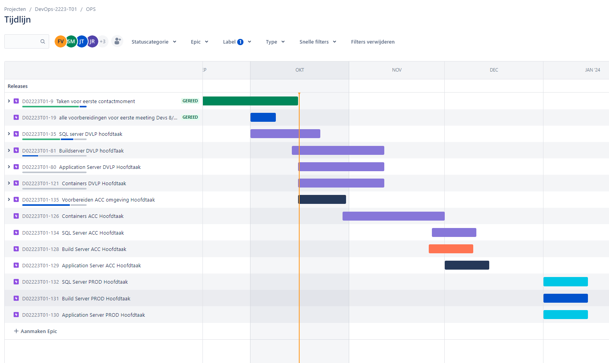

| Week | Opleveren                 |      |           |          |
| ---- | ------------------------- | ---- | --------- | -------- |
| 1    | voorbereiden              |      |           | ops Team |
| 2    | Analyse Infra en planning |      |           | ops Team |
| 3    | Build server              | DVLP | Analyse   | Ops1     |
|      | App Server                | DVLP | Analyse   | Ops2     |
|      | DB Server                 | DVLP | Analyse   | Ops3     |
|      |                           |      |           | Ops4     |
| 4    | Build server              | DVLP | Implement | Ops1     |
|      | App Server                | DVLP | Implement | Ops2     |
|      | DB Server                 | DVLP | Implement | Ops3     |
|      |                           |      |           | Ops4     |
| 5    | Build server              | DVLP | Test      | Ops2     |
|      | App Server                | DVLP | Test      | Ops3     |
|      | DB Server                 | DVLP | Test      | Ops4     |
|      |                           |      |           | Ops1     |
| 6    | Build server              | QA   | Analyse   |          |
|      | App Server                | QA   | Analyse   |          |
|      | DB Server                 | QA   | Analyse   |          |
|      |                           |      |           |          |
| 7    | Build server              | QA   | Implement |          |
|      | App Server                | QA   | Implement |          |
|      | DB Server                 | QA   | Implement |          |
|      |                           |      |           |          |
| 8    | Build server              | QA   | Test      |          |
|      | App Server                | QA   | Test      |          |
|      | DB Server                 | QA   | Test      |          |
|      |                           |      |           |          |
| 9    | Build server              | PROD | Analyse   |          |
|      | App Server                | PROD | Analyse   |          |
|      | DB Server                 | PROD | Analyse   |          |
|      |                           |      |           |          |
| 10   | Build server              | PROD | Implement |          |
|      | App Server                | PROD | Implement |          |
|      | DB Server                 | PROD | Implement |          |
|      |                           |      |           |          |
| 11   | Build server              | PROD | Test      |          |
|      | App Server                | PROD | Test      |          |
|      | DB Server                 | PROD | Test      |          |
|      |                           |      |           |          |
| 12   | Buffer                    |      |           |          |
|      |                           |      |           |          |
|      |                           |      |           |          |
|      |                           |      |           |          |
| 13   | Presentatie               | PROD |           |          |

Versie 2 in jira 

